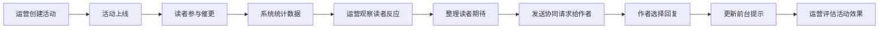

## 1. 产品概述
面向中小阅读平台运营人员的Web工作台，用于组织官方催更活动、观察读者反应、协同作者更新。通过透明化互动流程，帮助平台有节奏地调动读者热情，同时避免过度施压作者。

- **目标用户**：阅读平台运营人员、签约作者
- **核心价值**：让催更活动可量化、可协同、有温度，平衡读者期待与作者创作节奏

## 2. 核心功能

### 2.1 用户角色
| 角色 | 登录方式 | 核心权限 |
|------|---------|---------|
| 运营人员 | 账号登录 | 创建活动、监控数据、协同作者 |
| 签约作者 | 账号登录 | 查看读者期待、回复协同请求 |

### 2.2 功能模块
1. **活动创建页**：作品选择、活动周期设置、目标动作配置、文案与奖励编辑
2. **活动运行页**：参与数据看板、读者反馈分析、回流数据追踪、活动效果评估
3. **作者协同页**：读者期待整理、协同请求发送、作者回复管理、前台提示更新

### 2.3 页面详情
| 页面名称 | 模块名称 | 功能描述 |
|---------|---------|---------|
| 活动创建页 | 作品选择器 | 搜索筛选平台作品，支持多选 |
| 活动创建页 | 活动配置表单 | 设置活动名称、周期、目标动作类型（连续评论/达到想看数等） |
| 活动创建页 | 文案编辑器 | 配置展示文案、奖励说明、参与规则 |
| 活动创建页 | 高级设置 | 是否限制同一账号重复参与、活动触发条件 |
| 活动运行页 | 数据概览卡片 | 参与人数、有效催更数、回流阅读人数关键指标 |
| 活动运行页 | 读者留言分析 | 高频关键词云、正向/负向情感比例、热门留言展示 |
| 活动运行页 | 趋势图表 | 参与趋势、催更时段分布、回流数据对比 |
| 作者协同页 | 协同请求列表 | 待处理/已处理协同请求，显示作品、活动、期待摘要 |
| 作者协同页 | 作者回复面板 | 三选一回复：可加更/只能发进度说明/不参与活动 |
| 作者协同页 | 前台提示管理 | 根据作者回复自动更新前台活动提示文案 |

## 3. 核心流程
运营人员创建催更活动 → 活动上线后读者参与 → 系统实时统计参与数据与读者反馈 → 运营整理读者期待发送给作者 → 作者选择回复方式 → 系统更新前台提示 → 运营持续监控活动效果，判断活动是否需要调整

## 4. 用户界面设计

### 4.1 设计风格
- **主色调**：暖琥珀色 `#D97706`，代表书页温度与活动热情
- **辅助色**：深墨绿 `#065F46` 用于正向指标，砖红 `#991B1B` 用于负向预警
- **背景色**：深炭灰 `#1C1917` 搭配纸张质感米白 `#FEF3C7` 卡片
- **字体**：标题使用「思源宋体」体现书卷气，正文使用「Inter」保证可读性
- **按钮风格**：微圆角矩形，hover时轻微上浮+暖光阴影
- **图标风格**：线性图标搭配琥珀色填充，使用书籍、羽毛笔、沙漏等阅读相关元素

### 4.2 页面设计概述
| 页面名称 | 模块名称 | UI元素 |
|---------|---------|--------|
| 活动创建页 | 表单区域 | 卡片式分组布局，左侧步骤导航，右侧表单内容 |
| 活动运行页 | 数据看板 | 顶部关键指标卡片组，中部双栏布局（左侧图表，右侧留言分析） |
| 作者协同页 | 请求列表 | 表格+卡片混合布局，每行可展开查看详情与回复面板 |

### 4.3 响应式
- 桌面端优先设计（1280px+）
- 中等屏幕（1024px）：双栏布局变单栏堆叠
- 平板端（768px）：侧边导航收起为汉堡菜单
- 触控优化：按钮最小高度44px，关键操作区域加大触控面积
