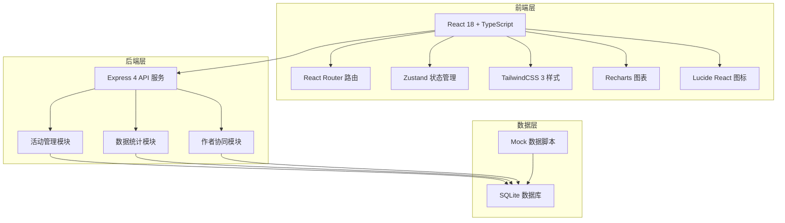
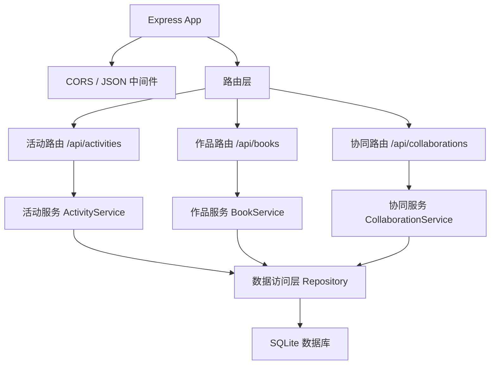
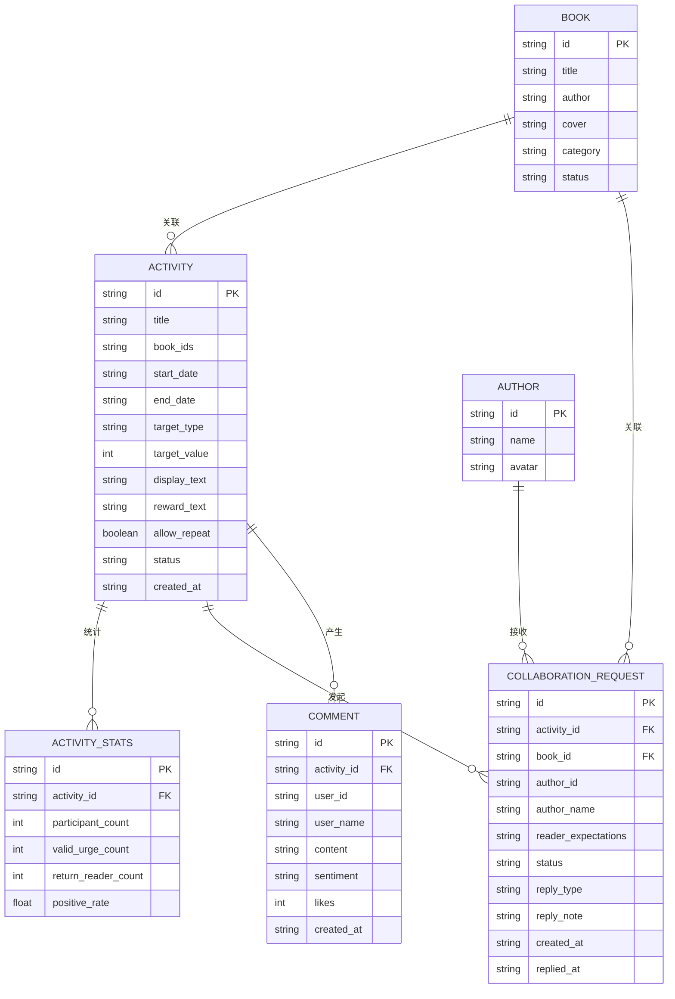

## 1. 架构设计



## 2. 技术描述
- **前端**：React@18 + TypeScript + Vite
- **样式**：TailwindCSS@3
- **状态管理**：Zustand
- **路由**：React Router DOM@6
- **图表**：Recharts
- **图标**：Lucide React
- **后端**：Express@4 + TypeScript
- **数据库**：SQLite（使用 better-sqlite3）
- **初始化工具**：vite-init
- **项目模板**：react-express-ts

## 3. 路由定义
| 路由 | 页面 | 说明 |
|------|------|------|
| `/` | 活动列表首页 | 展示所有活动概览，快速入口 |
| `/create` | 活动创建页 | 新建催更活动表单 |
| `/activity/:id` | 活动运行页 | 活动数据监控与分析 |
| `/author` | 作者协同页 | 协同请求列表与回复管理 |
| `/activity/:id/edit` | 活动编辑页 | 修改已有活动配置 |

## 4. API 定义

### TypeScript 类型定义
```typescript
interface Book {
  id: string;
  title: string;
  author: string;
  cover: string;
  category: string;
  status: 'ongoing' | 'completed';
}

interface Activity {
  id: string;
  title: string;
  bookIds: string[];
  startDate: string;
  endDate: string;
  targetType: 'comment_streak' | 'want_to_read' | 'likes';
  targetValue: number;
  displayText: string;
  rewardText: string;
  allowRepeat: boolean;
  status: 'draft' | 'active' | 'ended';
  createdAt: string;
}

interface ActivityStats {
  activityId: string;
  participantCount: number;
  validUrgeCount: number;
  returnReaderCount: number;
  positiveRate: number;
  trendData: { date: string; count: number }[];
  topKeywords: { word: string; count: number }[];
  hotComments: Comment[];
}

interface Comment {
  id: string;
  userId: string;
  userName: string;
  content: string;
  sentiment: 'positive' | 'neutral' | 'negative';
  likes: number;
  createdAt: string;
}

interface CollaborationRequest {
  id: string;
  activityId: string;
  bookId: string;
  authorId: string;
  authorName: string;
  readerExpectations: string;
  status: 'pending' | 'replied';
  replyType?: 'can_update' | 'progress_only' | 'not_participate';
  replyNote?: string;
  createdAt: string;
  repliedAt?: string;
}
```

### API 接口
| 方法 | 路径 | 说明 |
|------|------|------|
| GET | `/api/books` | 获取作品列表，支持搜索筛选 |
| GET | `/api/activities` | 获取活动列表 |
| GET | `/api/activities/:id` | 获取单个活动详情 |
| POST | `/api/activities` | 创建新活动 |
| PUT | `/api/activities/:id` | 更新活动 |
| GET | `/api/activities/:id/stats` | 获取活动统计数据 |
| GET | `/api/collaborations` | 获取协同请求列表 |
| POST | `/api/collaborations` | 创建协同请求 |
| PUT | `/api/collaborations/:id/reply` | 作者回复协同请求 |

## 5. 服务器架构



## 6. 数据模型

### 6.1 实体关系图



### 6.2 数据初始化脚本
使用 `better-sqlite3` 创建数据库表，并插入 Mock 数据用于演示：
- 10 本示例书籍（覆盖不同分类）
- 3 个示例活动（不同类型和状态）
- 若干评论、统计数据、协同请求
